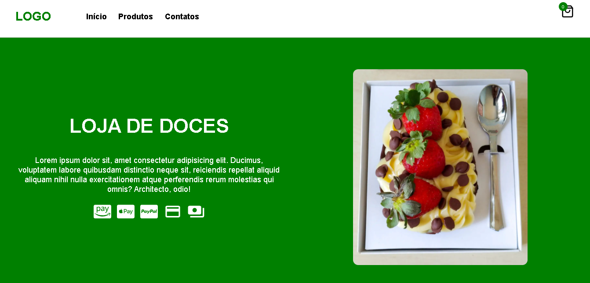

# Loja de Doces

Projeto web desenvolvido utilizando ReactJs, é uma Loja de Doces que permite você montar o seu carrinho e enviar o seu pedido para o whatsapp da loja, de modo a facilitar a comunicação entre cliente e loja.

## Feito Com:
* HTML
* CSS
* JAVASCRIPT
* REACTJS

## 🤝 Contribuição

Projeto aberto para ajuda!

Lembre de seguir os requisitos da licensa...

## 🔖 Licensa

### Support Ou Contato

Copyright © 2022 Eduardo Melo

